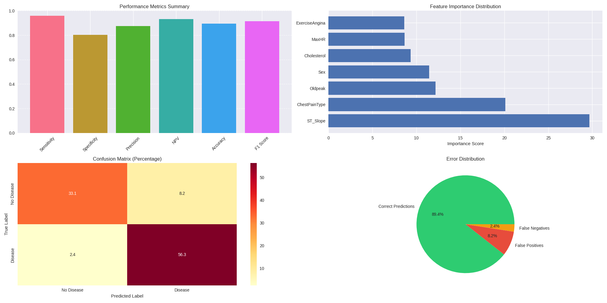

# Heart_Failure_Prediction

Dataset: 

Heart Attack Analysis
https://www.kaggle.com/datasets/rashikrahmanpritom/heart-attack-analysis-prediction-dataset?select=heart.csv

Heart Failure Prediction
https://www.kaggle.com/datasets/fedesoriano/heart-failure-prediction

Citation: 

fedesoriano. (September 2021). Heart Failure Prediction Dataset. Retrieved [Date Retrieved] from https://www.kaggle.com/fedesoriano/heart-failure-prediction.

# Performance Summary for CatBoost Model:

Detailed Metrics:
----------------------------------------
Sensitivity (Recall): 0.9583
Specificity: 0.8020
Precision: 0.8734
Negative Predictive Value: 0.9310
Accuracy: 0.8939
F1 Score: 0.9139

